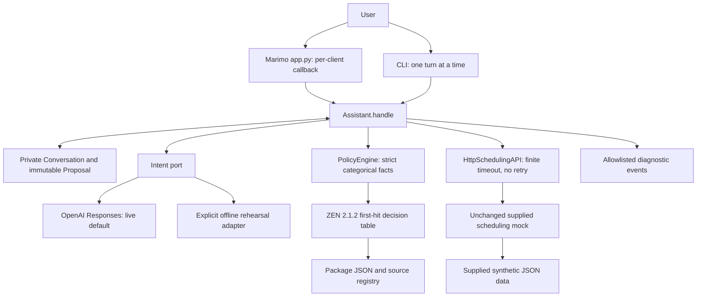
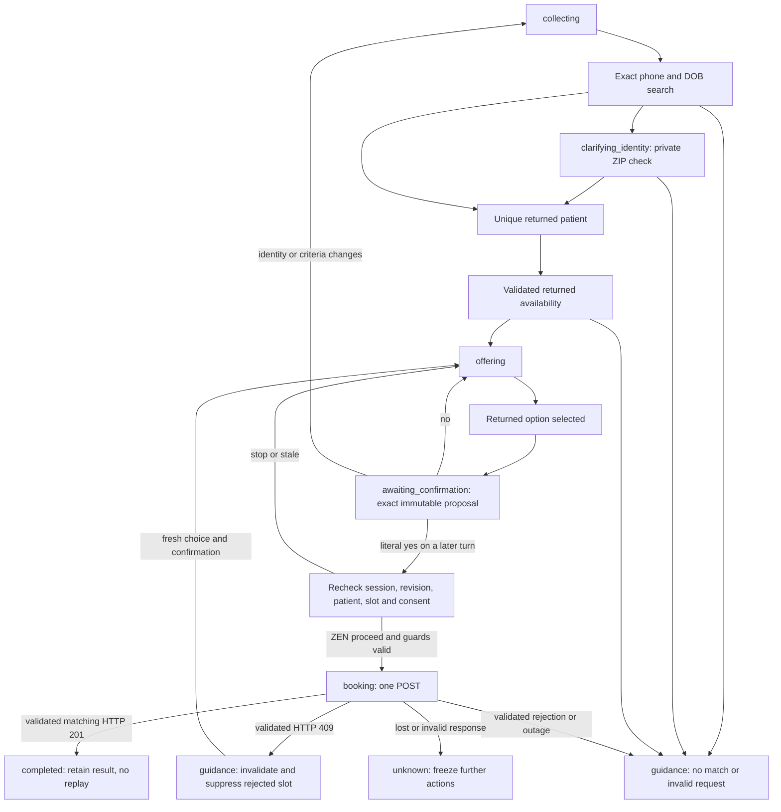

# As-built architecture

Updated: **2026-10-09**. Reviewed source revision: **49c5ad5706988be77770f646f202637d7f7acf43**.
Status: implementation reconciled with reviewed source and clean-clone MacARM/Linux qualification. Video capture remains separately blocked.

The application adds a guarded conversational client to the supplied scheduling mock. It does not replace that backend. The [specification](../../../specs/001-appointment-scheduling/spec.md), [interface contract](../../../specs/001-appointment-scheduling/contracts/interfaces.md) and [decisions](../../product/decisions.md) define accepted scope; the [walkthrough](code-walkthrough.md) maps implementation symbols. Planned architecture remains in [plan.md](../../../specs/001-appointment-scheduling/plan.md).

## Components and ownership

- [Core](../../../src/scheduling_assistant/core.py) owns the workflow, validation, private identity disambiguation, returned choices, proposals and effect authority. [Models](../../../src/scheduling_assistant/models.py) hold one conversation and its immutable proposal. A proposal binds session, identity/criteria revision, patient, slot, criteria snapshot and full slot signature.
- [Marimo](../../../app.py) and the [CLI](../../../src/scheduling_assistant/__main__.py) are thin adapters over the same core. The UI creates one private `UISession` per client and uses a nonblocking per-session lock. Only explicit form submission calls `Assistant.handle`; reactive rendering and opening the inspector do not execute effects. The UI retains the latest reply, not a transcript, escapes displayed text and renders only normalized policy fields. Local [approved assets](../ui-assets.md) supply branding.
- [Live intent interpretation](../../../src/scheduling_assistant/adapters/intent.py) is required and default. It calls the OpenAI Responses API with `store=False`, a strict extraction schema and no scheduling tools. Context contains state, intent and needed field names, not accumulated identity or private match candidates. The latest user message can contain synthetic identity data and is sent for interpretation. The adapter validates output and rejects authority fields or unsupported extractions. Explicit offline mode remains available for synthetic rehearsal; it is not live qualification.
- [PolicyEngine](../../../src/scheduling_assistant/policy.py) actually evaluates pinned ZEN 2.1.2. Its authoritative [first-hit table](../../../src/scheduling_assistant/policy_models/scheduling.json) and [source registry](../../../src/scheduling_assistant/policy_models/sources.json) are packaged resources, indexed by [policies](../../../policies/README.md). All ten fact keys must have known enum values. The core derives facts from validated state; neither user text nor model output supplies policy facts. Each trace includes the exact ten categorical inputs; the inspector validates their enum contract before displaying them, with no identity values. Unknown facts, engine/load/output errors and the final catchall stop progression. There is no Python rule fallback. Immutable decisions expose only disposition, reason, rule and source IDs.
- [HTTP adapter](../../../src/scheduling_assistant/adapters/http.py) maps the existing providers, patient search, availability and appointment endpoints. It accepts a configured loopback HTTP base, validates essential response fields, rejects redirects and uses finite timeouts without automatic retries. The [supplied server](../../../reference/mock-api/server.py), [OpenAPI](../../../reference/openapi/scheduling-api.yaml) and synthetic data remain reference implementation inputs with [provenance](../../../reference/PROVENANCE.md).
- [Diagnostics](../../../src/scheduling_assistant/diagnostics.py) allow only opaque local session tokens, categorical state/intent/operation/outcome/reason, valid status and bounded elapsed time. CLI diagnostics go to stderr. Raw utterances, prompts, service bodies, credentials and patient/appointment identifiers are excluded. The UI does not configure a persistent event sink.

ZEN evaluates permission to progress; it cannot verify identity, invent eligibility, choose a patient or slot, grant consent or perform an effect. The controller independently enforces transaction guards even if an engine returns `proceed` incorrectly. Some focused input clarifications occur before engine evaluation; the inspector is the actual bounded decision trace, not a claim that every UI message is a rule result.

## Booking state and effect boundary

Public provider lookup uses its own policy-gated read path and does not require patient identity. Booking searches exact phone/DOB; ambiguous matches remain private and use ZIP against returned candidates locally. The client does not invent a ZIP search parameter. It offers validated, available returned slots and preserves their explicit timestamp offsets.

Selection displays the exact appointment and creates a proposal; it never books on that turn. Confirmation uses a small deterministic literal set in the core, on a subsequent turn, against the still-current proposal. A model cannot set confirmation. Changes invalidate prior proposals; independent checks reject foreign or stale proposals before a write. The HTTP body adds `confirmed:true` only after those checks and ZEN approval.

A booking is reported successful only after HTTP 201 with a validated appointment matching the proposed patient, provider, specialty, location and time. The completed result prevents repeated confirmation from issuing another POST in the same conversation. A 409 invalidates the proposal and suppresses the rejected slot for the current search; another selection and confirmation are required. Indeterminate POST outcomes, malformed success data or mismatched appointments become `unknown`, not failure: the conversation freezes and directs human reconciliation. No retry or recovery endpoint is invented.

## Runtime and operational limits

Normal reset replaces local conversation state, not mock bookings. An unknown conversation rejects reset as reconciliation. The supplied mock stores effects in its process memory; restarting an owned mock resets that synthetic service state. Conversation state, completed-result replay protection and UI locks are also process-local. There is no durable idempotency, cross-session duplicate protection, appointment recovery API or production identity assurance.

Live operation requires the configured model credential; offline mode must be explicit. The UI normally listens on loopback port 28182 and the supplied interactive API on 4012. Disposable demos use their own ephemeral supplied mock. The [quickstart](../../../specs/001-appointment-scheduling/quickstart.md), [demo guide](../demo.md) and [operations](../operations.md) own exact commands, tested receipts and reset procedures. [Milestones](../milestones.md) identifies reviewed checkpoints; [tasks](../../../specs/001-appointment-scheduling/tasks.md) owns completion status.

This is a local PoC using synthetic fixtures. Medical advice, unsupported requests and requests for a human produce truthful guidance without triage or a queued handoff. No staff console, backend replacement, production deployment, delivery channel or production-readiness claim is implied.

## Verification map

[Core tests](../../../tests/test_scheduling_core.py) exercise independent consent/proposal guards, replay and privacy. [Policy tests](../../../tests/test_scheduling_policy.py) invoke actual ZEN for positive, missing, priority, invalid-context and engine-failure cases. [HTTP tests](../../../tests/test_scheduling_http.py) and [acceptance tests](../../../tests/test_scheduling_acceptance.py) cover supplied service semantics and uncertain writes. [Intent tests](../../../tests/test_scheduling_intent.py), [UI tests](../../../tests/test_scheduling_ui.py) and [diagnostic tests](../../../tests/test_scheduling_diagnostics.py) cover extraction boundaries, client isolation, rendering without effects and sensitive-value exclusion. Controlled tests complement the separately recorded live-model and browser qualification; they do not replace it.

Diagrams were checked against the inspected code and transition paths. Both Mermaid diagrams rendered successfully through a temporary loopback Marimo page in controlled IAB on2026-10-09; visible node/edge labels matched the documented components and transitions. Reviewed source49c5ad5 includes the final fact-inspection and diagnostic corrections.
